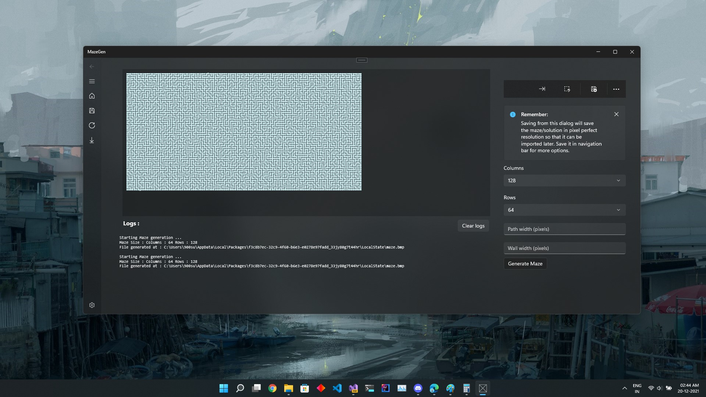

# MazeGen
Maze Generation App made in C++  using WinRT UWP. Which Generates Line and Cell based mazes using different techniques like Recursive Backtracking etc.

> Note the application can be retargeted but is not recommended to retarget below Windows 10 1803. As I have no way to test the compatibility of WinUI3.

